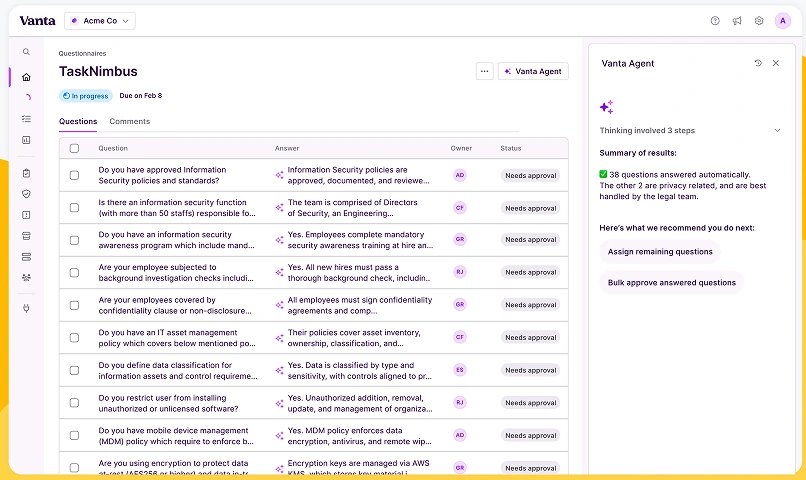
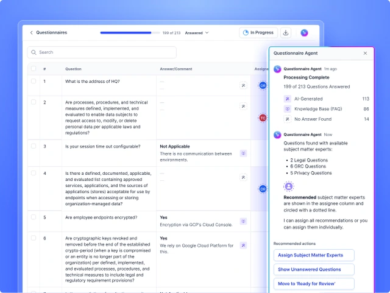
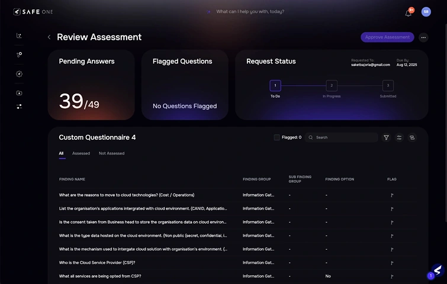
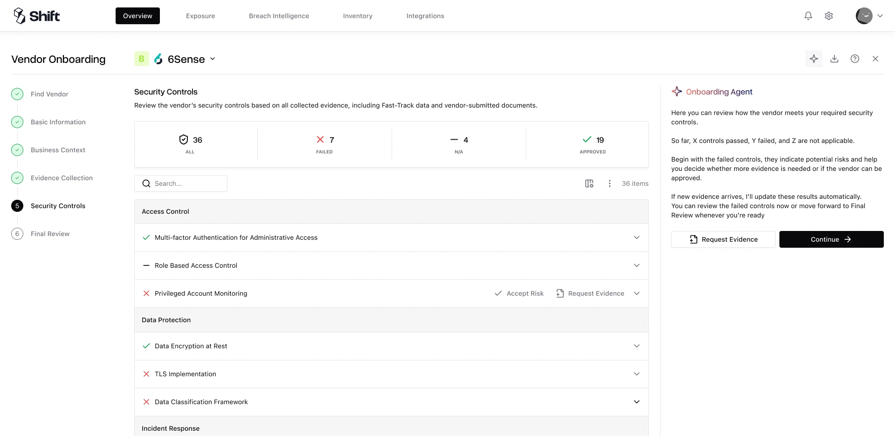
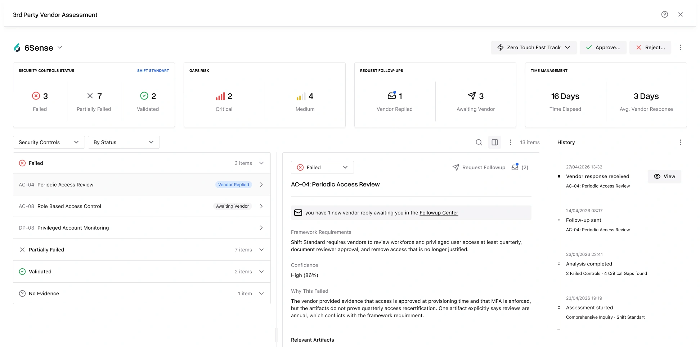
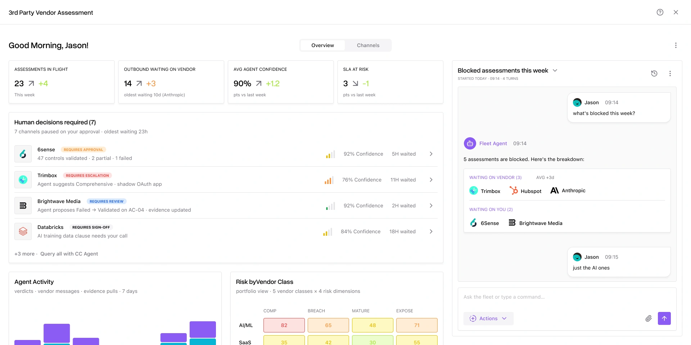
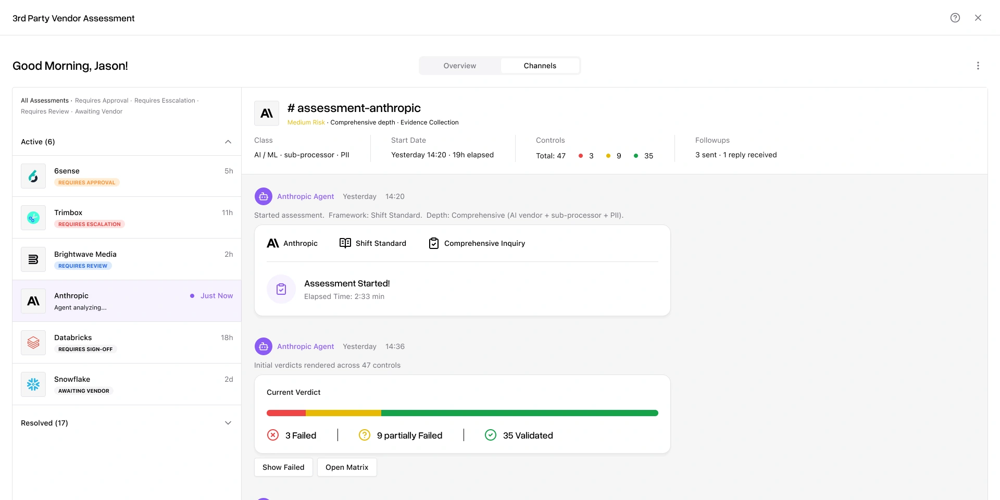

# Designing for the Supervisor

### Or how we reframed TPRM around the agent doing the work

---

In my current role at Shift, I've been working on the next generation of vendor risk software. The work began as a normal product iteration: better workspace, faster reviews. It gradually turned into something larger, a question about whether the underlying job had changed.

For two decades, third-party risk management has lived in spreadsheets, email threads, and Word documents. The first generation of dedicated tools, including [Vanta](https://www.vanta.com/), [Drata](https://drata.com/), and [OneTrust](https://www.onetrust.com/), pulled some of that work into product surfaces, and earned real ground for it. But the underlying motion stayed the same: humans collecting evidence, chasing vendors over email, grading responses by hand.

> The real question wasn't how to design a faster analyst workspace. It was whether the analyst was still the right person at the center of the workspace.

### Understanding the space

---

To frame the problem properly, I spent time mapping how a real assessment unfolds.

A reviewer picks a framework ([SOC 2](https://www.aicpa-cima.com/resources/landing/system-and-organization-controls-soc-suite-of-services), [ISO 27001](https://www.iso.org/standard/27001), a custom one). They pick a depth. They pull evidence from vendor uploads, threat intel feeds, or by chasing the vendor over email. They reason against each control. They render a verdict. They compose followups when something's missing. They wait. They re-read replies. They re-verdict. Eventually they approve or reject the vendor.

Per assessment, four to twenty hours of analyst time. Per analyst, a portfolio of dozens to hundreds.

A lot of that work is repetitive and pattern-rich: read documents, map evidence to language, ask vendors for missing items. The hard decisions sit at the margins: accepting unusual risk, judging a vague reply, calling something close.

This was the picture we were working from when AI capability started catching up to the job.

### Looking at the landscape

---

Before sketching anything new, I wanted to see what the rest of the market was doing.

**Direct peers.** [Vanta](https://www.vanta.com/) and [Drata](https://drata.com/) had begun adding AI features inside their existing workflow products. [Whistic](https://www.whistic.com/) was promoting AI agents for assessments. [Lema](https://www.lema.ai/), an AI-native startup, was positioning explicitly around risk engineering. [SAFE](https://safe.security/) was claiming end-to-end autonomy. The signal was clear: the category was moving, and AI was the frame everyone reached for.

  

What none of them seemed to have settled was the *operating model*: what the workspace looks like when the agent does the work and a person supervises. Most still framed AI as a feature inside an analyst-shaped product.

**Adjacent agent products.** I spent more time here than expected. [Devin](https://devin.ai/), [Cursor](https://cursor.com/), and [Claude Code](https://claude.com/product/claude-code) in software engineering. [Dropzone AI](https://www.dropzone.ai/) and [Crogl](https://www.crogl.com/) in security operations. [Harvey](https://www.harvey.ai/) and [Eve](https://www.eve.legal/) in legal. [Sierra](https://sierra.ai/) and [Decagon](https://decagon.ai/) in customer support. Different domains, but a recognizable pattern: the AI runs, the human supervises, and the workspace is built around that supervision.

Of these, Dropzone AI was the closest analog. Their agent investigates a security alert end-to-end, produces a report, asks the human to approve the response. Translate that into TPRM and you get something I recognized: agent assesses a vendor end-to-end, produces a report, asks the human to approve onboarding.

That's the moment the shape of the new product clicked.

### The reframe

---

I brought this thinking back to the team and the broader leadership group. The argument was simple:

> The work analysts do today is work an agent can handle now, with supervision. The product to build for the next cycle isn't a faster analyst workspace. It's a workspace for the supervisor of the agent.

The mental model shift sounds small written down, but it changes what a lot of the screens are *for*. The human isn't picking framework or depth anymore. The human isn't reading every control's evidence. The human isn't composing the followup email. The human is watching the agent work, intervening where it matters, deciding where the agent shouldn't.

After a few rounds of internal discussion across design, product, engineering, and security, we agreed this was the right frame to design against. The decision wasn't to ship a fully autonomous product immediately. It was to design as if the agent were doing more, and let trust build over time.

### First sketches

---

The first sketches asked a simple question: if the human is supervising rather than doing, what does their day look like?

Some of the early work still carried the familiar analyst-workspace shape: a stepper, a control matrix, and an assistant panel beside the work. It was useful because it showed what we were moving away from. If the agent was doing the repetitive assessment work, the product needed to make supervision feel primary, not secondary.

A few directions came up:

- **A queue of approvals.** Clean, but reductive. It framed the human as a button-presser and lost the texture of supervision.
- **A timeline per assessment.** Honest about the agent's ongoing activity, but didn't scale to a fleet.
- **A dashboard of assessments + drill-in.** The most familiar pattern, and the one we kept iterating on.

In parallel, I started sketching what the *inside* of an assessment looks like when the agent is doing the work and the human is asking questions about it. Modals didn't fit. The work isn't a moment; it's an ongoing conversation. A workspace tab felt too static. The shape that kept emerging was a channel: agent posts as it goes, human can read, ask, intervene at any point.

After several iterations, we landed on three surfaces.

### Three surfaces

---

**The fleet view.** The daily home. An operations console over the in-flight assessments, grouped by status, urgency, and whether anything needs the supervisor's attention. Closer in feel to an MSSP console than to a traditional GRC product. You scan, you take cross-cutting action, you drop back in.

**The channel per assessment.** When you click into one assessment, you enter its channel: a conversation with the agent about this vendor. Cards over bubbles, structured evidence, pinned decisions, accountability moments visible. Past, present, and future in one scroll.

What made the channel feel right wasn't the format. It was that it's *two-way*. The supervisor isn't watching an activity stream. They can ask the agent anything, with full context.

> *Why did you say Partially Failed on AC-04? What about their AI training data practices? Pull up the contract. Does it have a data-residency clause? How does this vendor compare to the last one we onboarded?*

The agent answers in context, with the evidence it already has, plus new pulls if needed. The channel becomes the supervisor's interrogation surface, not a log.

This surface also absorbed six things we used to draw separately: workspace, activity timeline, vendor conversation, followup center, approval modal, audit trail. Once we saw them as messages in a channel, the separate modals stopped making sense.

**The command bar.** A global input, available from anywhere. *Start onboarding for [6sense.com](https://6sense.com/). Show me all assessments awaiting decision. Why is the Trimbox assessment blocked?* Cmd+K, Spotlight, [Linear](https://linear.app/)'s command bar: the pattern is settled, and it fits the daily-driver persona who lives in the product.

### Agent guidance as a design primitive

---

Among the surfaces, the piece I keep coming back to isn't a screen at all. It's a text artifact the agent reads as input every time it runs: versioned, human-editable, named after the convention software engineers have settled on for agent instructions.

Three levels, all written in natural language:

- **Global policy.** Applies to all assessments. *"Never auto-approve sub-processors handling PII without legal review."*
- **Class instructions.** Applies to all vendors of a class. *"For AI vendors, always check training data sources and opt-out mechanisms."*
- **Per-assessment notes.** Applies to one assessment. *"They're mid-acquisition by a larger company; account for transition."*

This is how the supervisor "trains" the agent without writing code. The user writes soft policy in natural language; the agent uses it to shape drafts, requests, and decisions. Inline corrections, *you got this wrong on AC-04, save as a rule*, persist as policy.

It's the closest TPRM has come to programming. And it became the design pattern I'm most curious to push on next.

### Designing what stays human

---

Inside all of this, an unexpectedly important design principle emerged: design the surfaces *around* what the agent can't take over.

- Independent judgment under ambiguity: the agent surfaces the ambiguity, the human decides
- Policy calls and risk acceptance: approving a high-risk vendor is a human accountability moment, made visible
- Conflict resolution when evidence pulls in two directions
- Long-horizon planning across many vendors and multi-month cycles

The important part isn't where the line sits. It's that the line is now *visible*. The product can make those moments feel intentional, with pinned decision cards, evidence inline, and a human signing off on something they can see. Those moments stop being indistinguishable from the rest of the queue.

### Reviewing with stakeholders

---

Before committing further design and engineering, I wrote the thinking up as a strategic proposal and brought it to leadership.

The decision asked of the group was whether to commit to this direction: building toward an agent supervision platform for TPRM, rather than continuing to refine the analyst workspace. The proposal was deliberately structured around what we knew versus what we were betting on. Competitor releases showed the category moving toward agent-led work. The team's own experiments showed the capability was within reach. The piece that needed real evidence was customer trust: whether a CISO would accept agent-drafted outbound communication, and on what terms.

The recommendation was to start with the smallest customer-visible slice: the agent drafting and sending followup emails, with reviewer approval, parsing replies into verdict-change proposals. Contained. Customer-visible. Producing the trust evidence the larger product needs.

That's the wedge we're now designing in detail.

### What I'm taking away

---

A few things stood out while working on this.

> The hardest part isn't the AI capability. It's designing the workspace for the person *supervising* the AI, which is a different job from the one we've been designing for.

A few specifics:

- Channels and message types, not modals and forms, are the new core design surface. The agent's vocabulary becomes the design language.
- Notification discipline matters more than ever. Surface only the moments that need a human; let everything else live queryable in the channel.
- Eval data is a product surface, not just engineering telemetry: what the agent gets right, what it gets wrong, where humans override. Customers will ask how you know it's right. The eval data is the answer.

This work sits between product strategy and design. That's the layer I like: the category is mid-migration, and the supervision operating model is still being written.
