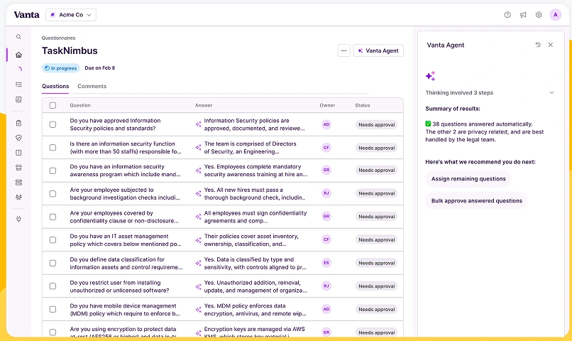
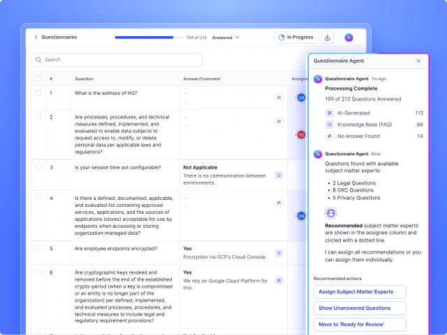
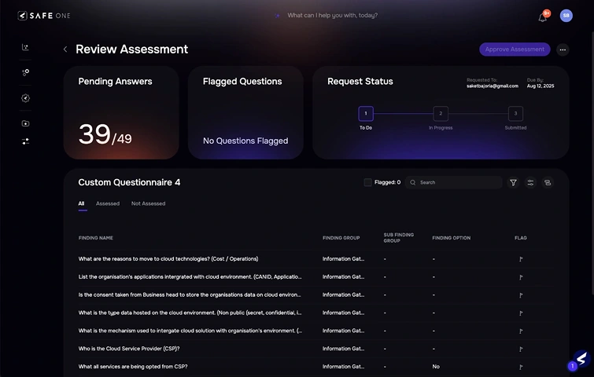
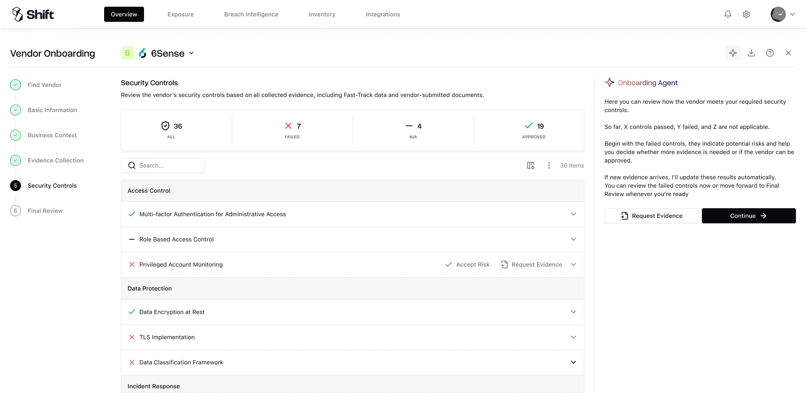
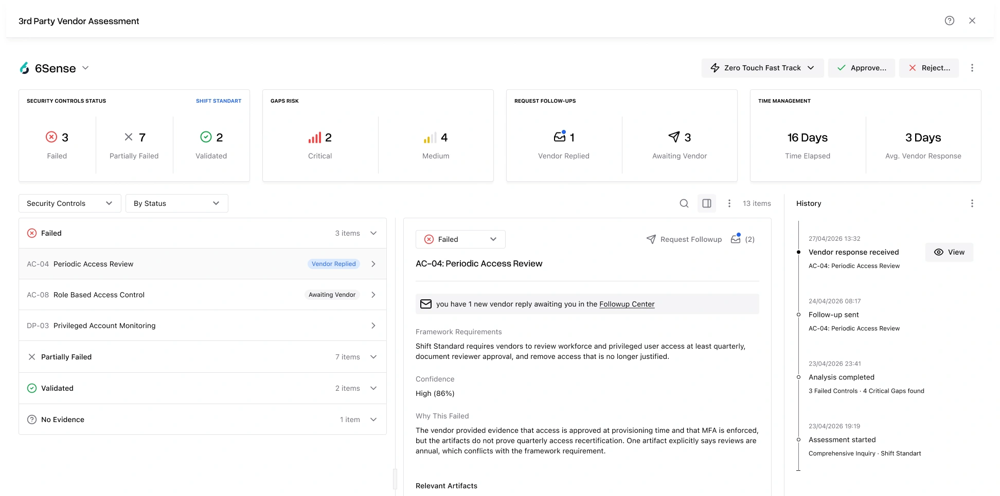
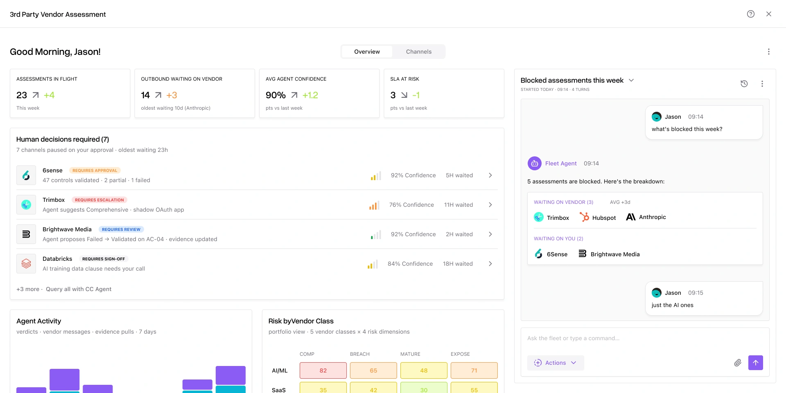
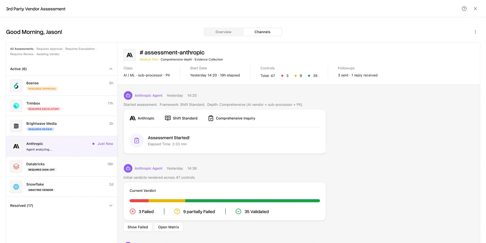

# Designing for the Supervisor

### Reframing TPRM around an agent-led workflow

---

At Shift, our work on vendor risk software began with a familiar brief: improve the workspace and help reviewers complete assessments faster. As we mapped the operation, a larger product question emerged. If an AI agent could perform more of the repetitive assessment work, what job was left for the person using the product?

Third-party risk workflows long predated today's dedicated platforms. Tools such as [Vanta](https://www.vanta.com/), [Drata](https://drata.com/), and [OneTrust](https://www.onetrust.com/) brought questionnaires, evidence, and review activity into a product. Much of the operation still depended on people collecting documents, chasing vendors over email, and grading responses by hand.

> The real question wasn't how to make the analyst faster. It was whether the analyst was still the right person at the center of the workspace.

### Mapping the operation

---

I started by mapping how a real assessment actually unfolds.

A reviewer chooses a framework such as [SOC 2](https://www.aicpa-cima.com/resources/landing/system-and-organization-controls-soc-suite-of-services), [ISO 27001](https://www.iso.org/standard/27001), or an internal standard. They set the depth. They gather evidence from vendor uploads and threat-intelligence feeds, map it to controls, and request what's missing. They wait. They re-read replies. They re-verdict. Eventually the team approves or rejects the vendor.

Per assessment, four to twenty hours of analyst time. Per analyst, a portfolio of dozens to hundreds.

Much of that work is repetitive and pattern-rich. The consequential decisions sit at the margins: accepting unusual risk, judging an unclear reply, or resolving evidence that points in different directions.

This division between repeatable work and accountable judgment became the basis for the product direction.

### Reviewing the market

---

Before sketching a new product model, I reviewed how direct competitors and adjacent agent products divided work between AI and people.

**Direct peers.** At the time of the scan, [Vanta](https://www.vanta.com/) and [Drata](https://drata.com/) were adding AI capabilities to established workflow products. [Whistic](https://www.whistic.com/) was presenting agents for assessments. [Lema](https://www.lema.ai/) was positioning around risk engineering, while [SAFE](https://safe.security/) was presenting an autonomous TPRM model. The signal was clear: the category was moving, AI was the frame everyone reached for, and yet the products expressed very different views of what AI should own.

  

My main takeaway concerned the *operating model*. Several products added AI to a workspace still organized around an analyst completing the assessment. I wanted to explore the inverse: a workspace organized around a person supervising work performed by an agent.

**Adjacent agent products.** I studied [Devin](https://devin.ai/), [Cursor](https://cursor.com/), and [Claude Code](https://claude.com/product/claude-code) in software development; [Dropzone AI](https://www.dropzone.ai/) and [Crogl](https://www.crogl.com/) in security operations; [Harvey](https://www.harvey.ai/) and [Eve](https://www.eve.legal/) in legal; and [Sierra](https://sierra.ai/) and [Decagon](https://decagon.ai/) in customer support.

Dropzone AI was the closest analog. Its agent investigates a security alert and produces a decision-ready report with a recommended action. Translated into TPRM, the pattern became recognizable: an agent assesses a vendor, presents its evidence and conclusion, and leaves the consequential decision with a person. That's the moment the shape of the new product clicked.

### The product reframe

---

I brought the market scan and operating-model proposal to the product team and the broader leadership group.

> Repetitive assessment work can increasingly move to an agent. The product should be organized around the person who reviews exceptions and remains accountable for the decision.

That shift changes what the screens are for. Instead of requiring the reviewer to perform every step, the product lets them inspect the agent's reasoning, intervene where judgment is needed, and define where the agent should stop.

After discussions across design, product, engineering, and security, we chose this as the direction to test. The plan was not immediate full autonomy. It was to expand the agent's responsibility in controlled steps and use customer behavior to understand where trust held or failed.

### Testing the workspace model

---

The first sketches asked what a reviewer's day would look like if supervision became the primary job.

Early directions kept the familiar analyst workspace: a stepper, control matrix, and assistant panel beside the work. Those concepts made the conflict visible. The person still appeared responsible for the process while the agent remained an optional helper.

We explored three directions:

- **A queue of approvals.** Clear, but too reductive. It treated the supervisor as a button-presser and removed the context needed for judgment.
- **A timeline for each assessment.** Honest about ongoing agent activity, but difficult to scan across many vendors.
- **An assessment fleet with drill-in.** Familiar enough to navigate and able to show both the portfolio and the work inside one assessment.

The fleet became the organizing model. Inside each assessment, a second pattern emerged. The agent's work was not a single modal or a static workspace. It was an ongoing exchange that needed history, evidence, questions, and intervention in one place. A channel fit that behavior.

### Three connected surfaces

---

**The fleet view.** The daily home for in-flight assessments, grouped by status, urgency, and whether the supervisor needs to intervene. It behaves more like an operations console than a traditional GRC dashboard.

**The assessment channel.** Each assessment has a channel with the agent. Structured evidence, questions, follow-ups, proposed verdicts, and human decisions share one history.

What made the channel feel right wasn't the format. It was that it's *two-way*: the supervisor isn't watching an activity stream, they're interrogating it.

> *Why did you mark AC-04 as partially failed? How does the vendor use customer data for AI training? Pull up the relevant contract clause. Compare this answer with our last approved AI vendor.*

The channel absorbed six things we used to draw separately: the assessment workspace, activity timeline, vendor conversation, follow-up center, approval modal, and audit trail. Once we saw them as messages in a channel, the separate modals stopped making sense.

**The command bar.** A global input for starting work or querying the portfolio from anywhere. *Start onboarding for [6sense.com](https://6sense.com/). Show assessments awaiting a decision. Why is the Trimbox assessment blocked?* Familiar command-bar patterns made this interaction legible to a daily user.

### Agent guidance as product policy

---

One concept was not a screen at all. It was a versioned, human-editable instruction document that the agent could use as policy while working on an assessment.

We explored three levels, all written in natural language:

- **Global policy.** Applies to every assessment. *"Require legal review before approving a subprocessor that handles personal data."*
- **Vendor-class instructions.** Applies to a category. *"For AI vendors, check training-data sources and opt-out mechanisms."*
- **Assessment notes.** Applies to one vendor. *"The company is being acquired; account for the transition in ownership and controls."*

This would let a supervisor guide the agent without writing code. Natural-language policy could shape drafts, requests, and proposed decisions. A correction such as *you got this wrong on AC-04; save it as a rule* could become a reviewable policy change instead of disappearing inside one conversation.

The concept made agent guidance part of the product model rather than an implementation detail. It's also the closest TPRM has come to programming, and the pattern I'm most curious to push on next.

### Designing human accountability

---

The product needed to make the decisions that require human accountability easy to find and properly informed:

- Judgment when the evidence is incomplete or ambiguous
- Policy exceptions and formal risk acceptance
- Conflicts between evidence sources
- Decisions that affect several vendors or a long-running program

The important part isn't where the line sits; the boundary will move as the system earns trust. It's that the line is *visible*: pinned decisions, evidence in context, and a human signing off on something they can actually see. Those moments stop being indistinguishable from the rest of the queue.

### Turning direction into a test

---

Before committing further design and engineering, I wrote the direction as a strategic proposal for leadership. It separated what we knew from what we were betting on. Competitor releases showed a move toward agent-led work, and our internal experiments suggested the capability was viable. The open question was customer trust, particularly around an agent communicating with vendors.

We recommended starting with a contained, customer-visible slice: the agent drafts follow-up emails for reviewer approval, then parses replies into proposed verdict changes. This would test whether customers trusted the agent's external communication without requiring them to accept the entire operating model at once.

That wedge gave the team a practical first test for the broader direction.

### What I am taking forward

---

> The hardest part isn't the AI capability. It's designing the workspace for the person *supervising* the AI, which is a different job from the one we've been designing for.

- Channels and structured message types can replace a collection of disconnected forms and modals.
- Notification discipline matters. Only work requiring a person should interrupt them; everything else should remain inspectable.
- Evaluation data should become a product surface: what the agent gets right, where it fails, and where people override it. That evidence is part of how a customer decides whether to extend trust.

This work sits between product strategy and design: a market shift, an operating-model decision, a sequence for testing trust, and the interaction system that makes the direction usable. That's the layer I like. The category is mid-migration, and the supervision operating model is still being written.
