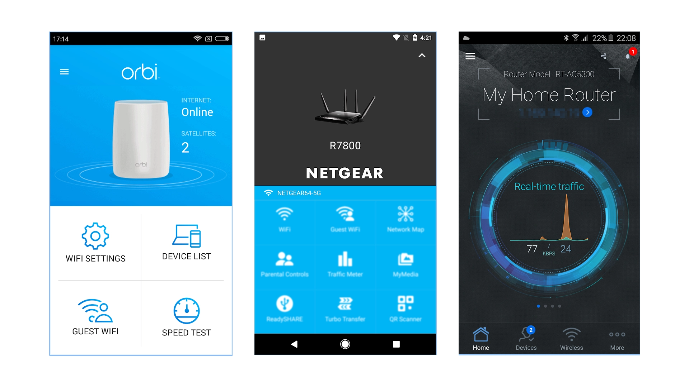
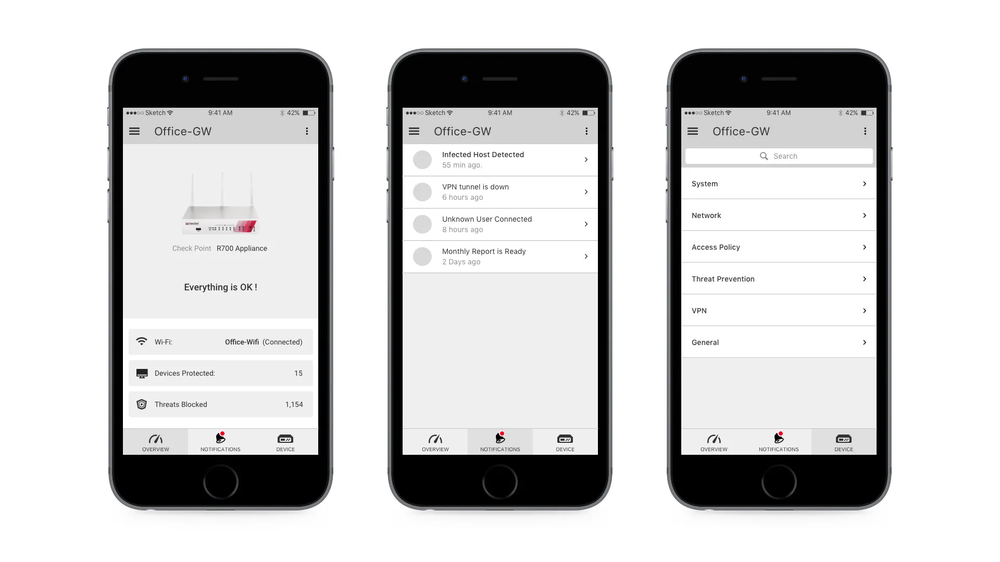
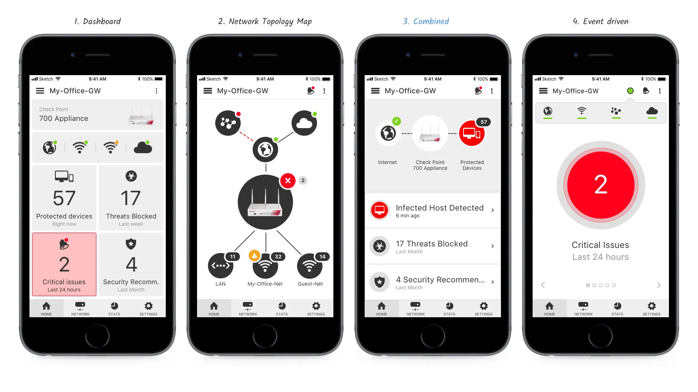
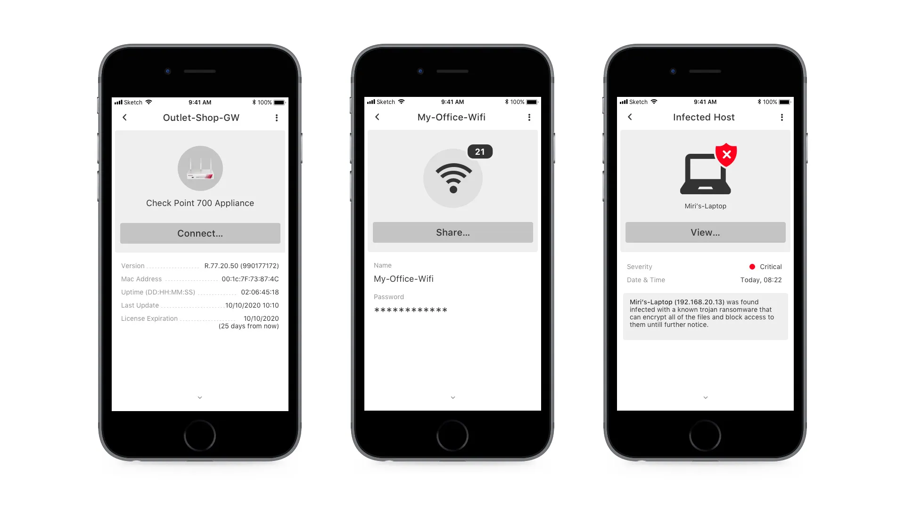
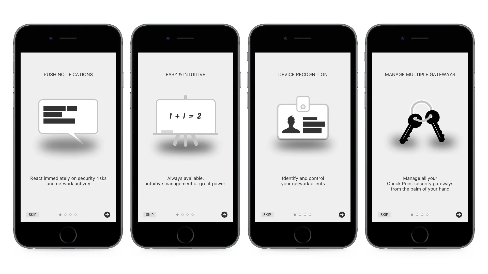
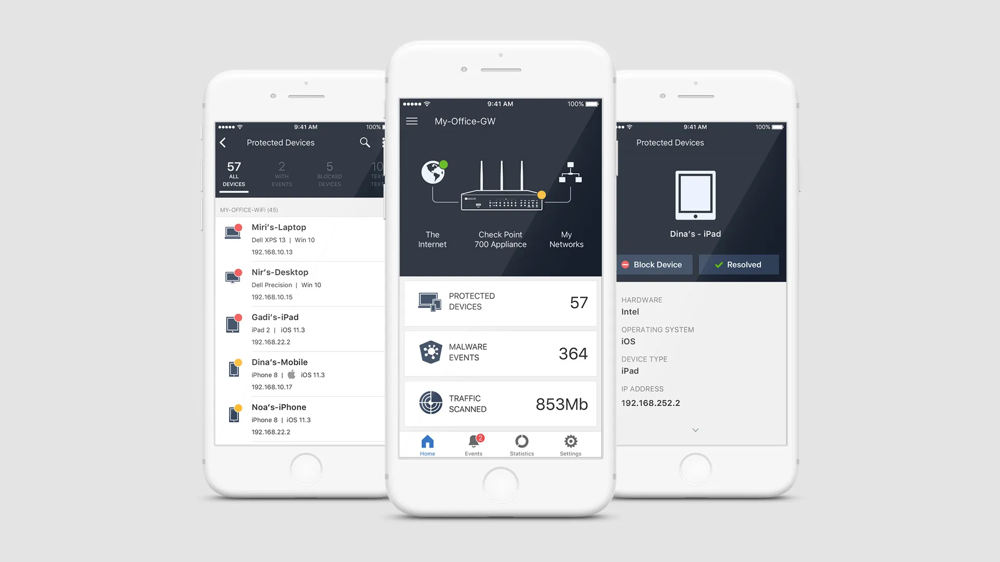

# Falling Down The Rabbit Hole

### Introduction

---

While on the UX team at [Check Point](http://www.checkpoint.com/), I was assigned a unique project.

A major partner of Check Point's SMB department requested assistance in promoting Check Point's SMB security appliances to their customers.

The challenge was to articulate the value of this more expensive security bundle service, as customers were exploring cheaper alternatives. We decided to highlight the appliance's superior security capabilities through a mobile application which would illustrate how it protects users around the clock.

Our main hurdle was adapting our development pipeline, traditionally not designed for B2C products, to meet the requirements of this project.

### Research

---

As we were falling down the rabbit hole, we proceeded with caution. Assisted by experienced sales personnel from our partner, we created personas to represent potential users of our product.

The first persona, "John the Network Admin," works at a medium-sized company, handling IT tasks and some security aspects. Due to his busy schedule, he could benefit from additional assistance.

The second persona, "Gill the Prosumer," although not a security professional, is a consumer who values network security and understands its significance.

The third persona, "Dan the Home User," has a sophisticated router but lacks extensive knowledge of network security. His primary concern is his home Wi-Fi network and the issue of his son's Xbox not connecting to the online store.

After defining our personas, we investigated the competition, analyzing similar products from Asus, Netgear, Norton, and Google, and noting their significant features. This helped us envision what our product might look like.

Taking these new personas and features into account, we aimed to understand how we could differentiate ourselves from our competitors. We sought to provide our new users with the value they need by leveraging our capabilities.

The primary conclusion from our research is that, to create an exceptional product, we need to combine enterprise-grade security capabilities from Check Point with the simpler needs of SMB users into a single, superior product.

### High-level design

---

The initial stage in planning a product's user experience involves crafting simple user stories to illustrate the user's interaction with the product.

> Analyzing these user stories enables us to prioritize features for development and to design the user interface.

Once we gather a sufficient number of user stories, we pinpoint the features mentioned in each one and rank them according to importance. This helps us decide where to start and what to address later.

A primary feature that surfaced from the user stories was the ability to receive push notifications regarding security events and appliance health issues.

This feature will considerably enhance the app, as it will revolutionize how users engage with the appliance. By keeping users informed about potential incidents, we can transition them from a passive state (unaware of what's happening) to an active one where they are in control of their security. This underscores the value of the appliance.

Other important features that emerged from the user stories include:

- **Network snapshot:** identifying connected devices to spot potential threats
- **Quick actions:** device blocking, Wi-Fi sharing, quick configuration, and more
- **Connectivity status:** determining current connectivity, such as Internet or VPN
- **Events history:** reviewing incidents from the past 24 hours, day, or week
- **Large scale:** managing multiple appliances

### UI patterns

---

With the wealth of data available, we began constructing high-level mockups for the application's user interface. We understood the necessity of supporting both iOS and Android platforms and sought to create a flow that felt native to each operating system.

We aimed to ensure that the UI prioritized ease of use and intuitiveness, offering a minimal learning curve.

To prevent complications, we established some basic guidelines:

- Only relevant information should be displayed on the screen. Just because data is available doesn't mean it needs to be shown. Its inclusion should serve a purpose.
- The UI should help users solve their problems and present a recommended solution (ideally one option), without leaving them at a dead end.
- Deep drill-downs (more than 2 layers) should be minimized to reduce complexity and prevent user disorientation.

After exploring various navigation patterns, we decided on the bottom tabbed navigation pattern, which best met our needs. Although it might be less popular on the Android platform, its increasing support in the material design library and its prevalence in major apps gave us the confidence to use it.

During our design process, we tested different sets of tabbed content for the main app navigation. We ultimately chose a 4-tab navigation in the following order (from left to right): Home, Events, Statistics, and Settings.

The home tab view was given special consideration since it is the user's initial interaction with the app. We aimed to make it easily understandable and engaging, with meaningful data. It should encapsulate the essence of the app and offer relevant points of interest for all user personas.

After considering various concepts and engaging in extensive discussions, we chose to proceed with the combined view (option no. 3) as it seemed the most suitable.

The basic structure of the view is a vertical split screen. The upper part displays a simplified network topology map, providing a quick overview of the current network status. All items on the map are interactive, allowing the user to navigate to other relevant app sections by tapping them.

The bottom part focuses on security. We designed a list view structure that displays urgent issues and provides more information with a single tap.

> Throughout the design process, we continuously referred back to our user stories and aligned them with the proposed UI, making necessary adjustments. Feedback from management and other teams greatly assisted us in finding the right solutions.

At this stage, we moved on to the next phase of detailing each layout and page to get a comprehensive view of all possible layouts, screens, and flows within the app.

### User onboarding

---

As a pure B2B organization, we initially found it challenging to comprehend the significance and necessity of this flow. Notoriously known for lacking such flows, it was difficult to convey its importance to management. However, after reviewing examples and engaging in discussions, everyone became convinced of its necessity.

A quick win was discovered during development that significantly reduced the onboarding time. The development team came up with a simple QR scan solution for some connection pages during the deployment of the appliance. This made the lengthy form page, which was challenging to use on a mobile device, obsolete.

### Usability testing

---

During the design process, we conducted multiple usability testing sessions in our in-house usability lab.

One valuable lesson we learned was to allow the test participants to choose their "native" phone for the tests. We observed that when using other phones, they often encountered difficulties with the operating system, which distracted them from focusing on the tests.

### Product launch

In April 2019, we launched the app on both stores.

### Conclusion

---

Working on this project was a refreshing change from my usual tasks in the UX team.

My worries about how the development pipeline would manage such a B2C effort were assuaged. The entire team assigned to the project understood the adjustments necessary for its success.

This project undoubtedly reignited my passion for designing engaging products.
