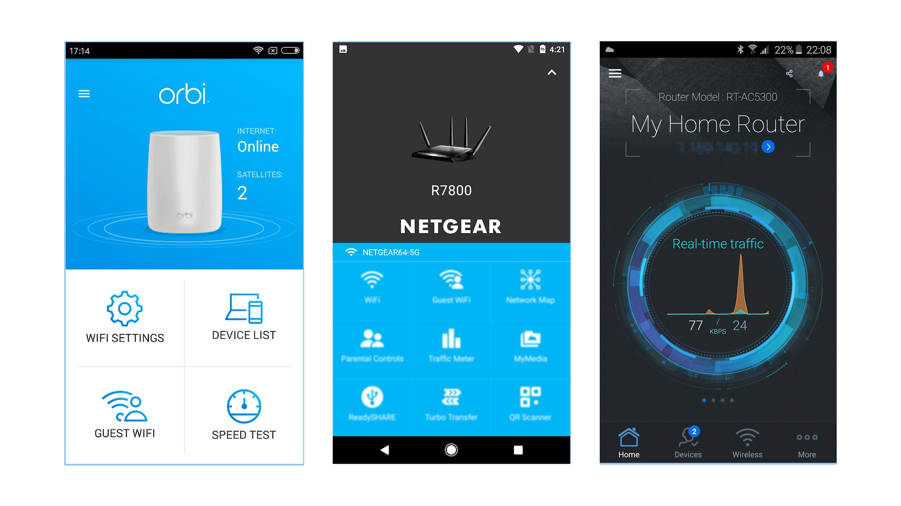
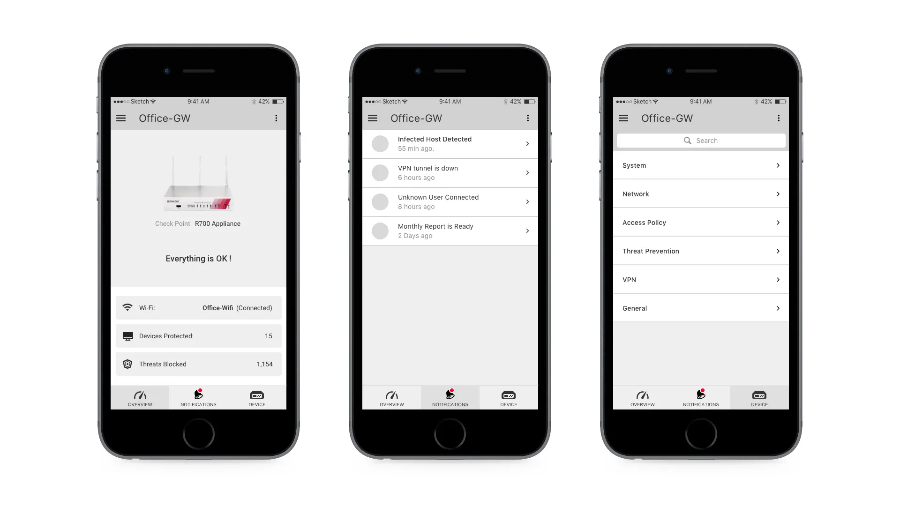
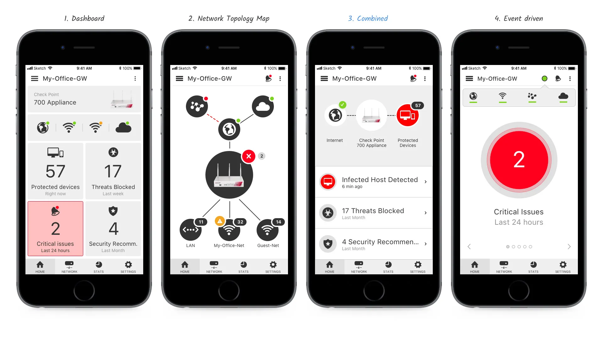
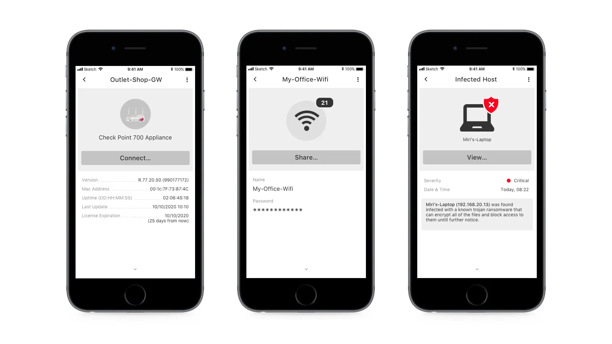
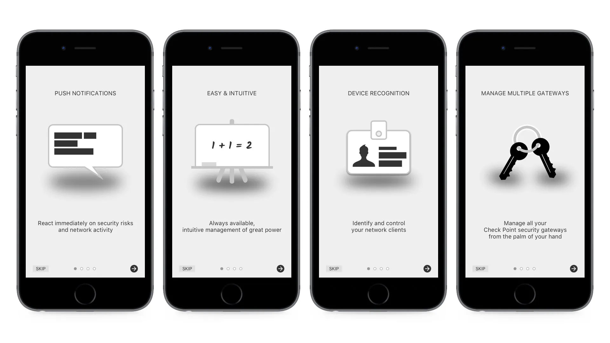
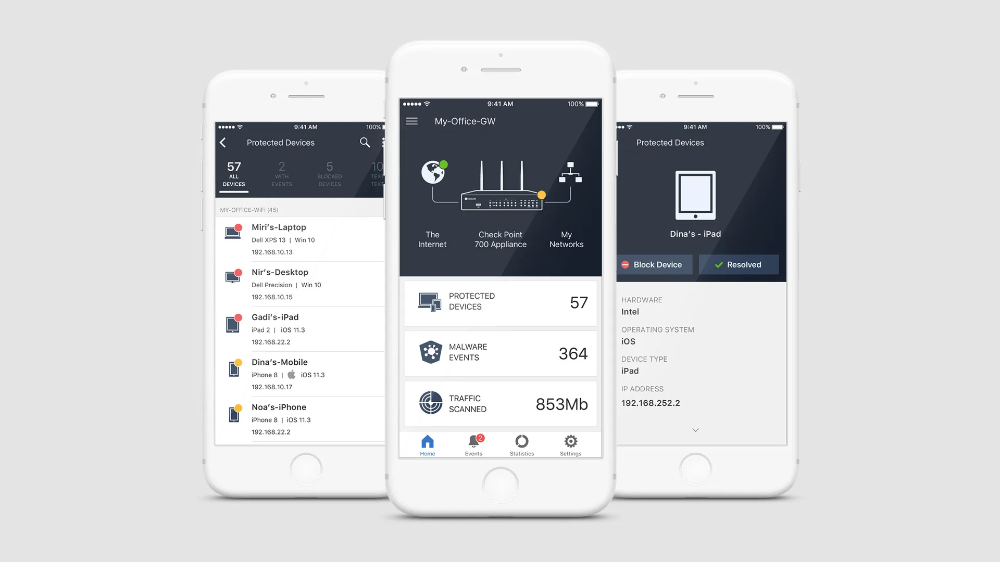

# Falling down the rabbit hole

### Shipping a consumer-style mobile app inside an enterprise security company

---

At Check Point, I usually worked on complex enterprise security management. WatchTower began with a different product problem. A major partner wanted a clearer way to show customers the ongoing value of Check Point's small-business security appliances.

The appliance protected the network continuously, but much of that work remained invisible until something went wrong. We proposed a mobile app that would make the service tangible: show network and security status, notify the customer when attention was needed, and provide a small set of actions away from the management console.

The design challenge extended beyond the interface. Our development and release process was built for enterprise B2B software. Shipping a focused iOS and Android experience required the team to make different decisions about scope, onboarding, usability, and communication.

That was the rabbit hole: the security underneath was familiar, but every rule about building and shipping the product was not.

### Defining the audience

---

Salespeople from our partner helped us understand the range of customers using the appliances. Three broad groups appeared:

- IT administrators managing a small or medium business alongside many other responsibilities
- Security-aware business owners who understood the value of protection but did not operate security tools every day
- Home and small-office users with practical concerns: Wi-Fi access, connected devices, and why the Xbox suddenly can't reach its online store

The groups had different levels of security knowledge, but they shared a need for a quick answer to two questions: *Is the network okay? Is there anything I need to do?*

We also reviewed consumer network and security products from Asus, Netgear, Norton, and Google. Their products established familiar mobile patterns, while Check Point could contribute deeper security information and mitigation controls.

This led to a clear product direction: expose the value of enterprise-grade security through a mobile experience that did not require enterprise expertise.

### Choosing the first-release value

---

Push notifications became the central capability. An appliance usually sits in the background. A timely notification could show that protection was active, explain what happened, and give the customer an action when one was required.

The first-release scope also included:

- **Network snapshot:** connected devices and current network status
- **Quick actions:** block a device, share Wi-Fi access, or open a relevant configuration
- **Connectivity:** internet and VPN status
- **Event history:** recent network and security events
- **Multiple appliances:** switch between gateways from one account

The point was not to reproduce the desktop console on a smaller screen. The app needed to present the state, explain the issue, and offer the next useful action.

### Building the mobile structure

---

We needed one information architecture that could feel familiar on both iOS and Android. After comparing navigation models, we chose four bottom-level destinations: Home, Events, Statistics, and Settings.

The Home tab carried the most product responsibility. It had to serve users with different levels of technical knowledge without turning into a summary of every available data point.

We selected a vertically divided layout. The upper section showed a simplified network topology with interactive devices and connections. The lower section prioritized security events that required attention. A user could understand the current state at a glance, then move directly to the relevant detail.

This structure also helped the team decide what did not belong in the app. Deep configuration and long diagnostic flows remained in the existing management experience. Mobile focused on awareness, immediate action, and a route to more detail.

### Making onboarding part of the product

---

The existing enterprise process assumed that deployment and configuration happened elsewhere. A mobile app could not rely on that assumption. A customer needed to connect the app to an appliance before any of its value was visible.

During development, engineering proposed using a QR code for connection steps that previously required a long form. Scanning the code removed manual entry on a small screen and reduced a fragile setup sequence to a direct handoff between the appliance and the app.

The QR flow was a useful example of product work crossing disciplines. The best onboarding improvement did not begin as a visual treatment. It came from combining a technical capability with a clear understanding of where users were likely to fail.

### Testing on familiar devices

---

We ran usability sessions in Check Point's in-house lab. One practical lesson changed how we prepared the tests: participants performed better on the mobile operating system they used every day.

When we handed someone an unfamiliar phone, part of the session measured their knowledge of the device rather than the product. Letting participants use a familiar operating system kept the test focused on navigation, terminology, and security decisions.

### Launch and takeaway

---

WatchTower launched for iOS and Android in April 2019.

The project showed me that the product process itself sometimes needs redesign. The team had to reduce an enterprise security system to its most useful mobile moments, introduce onboarding where the organization had little precedent, and coordinate design and engineering decisions across a new release model.

For me, that was the lasting value of the work: product design was not limited to drawing the app. It helped an enterprise team decide what the mobile product should be and adapt how it would be built.

It also reignited my passion for designing engaging products, the kind people open because they want to.
