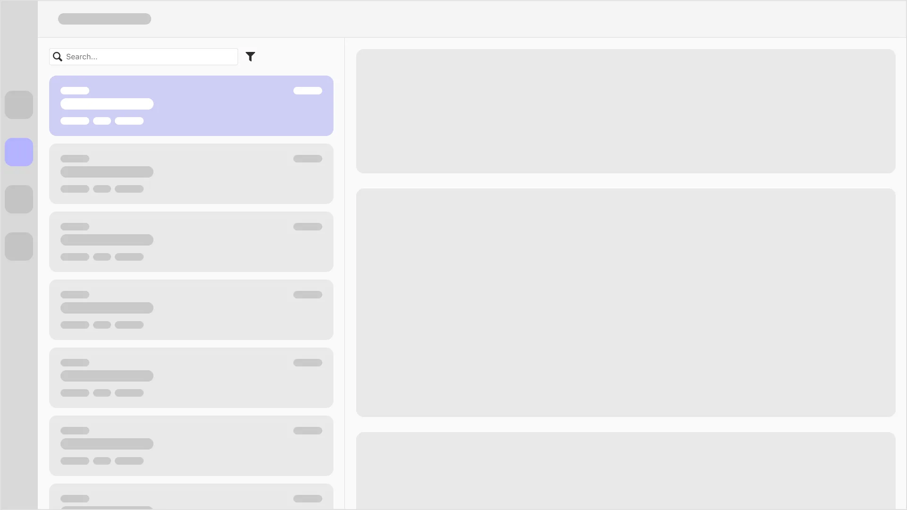
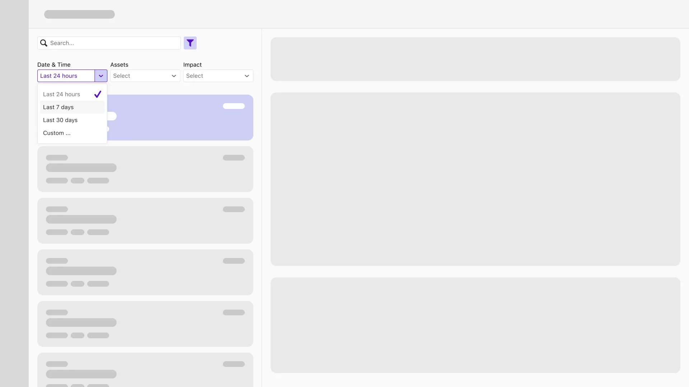
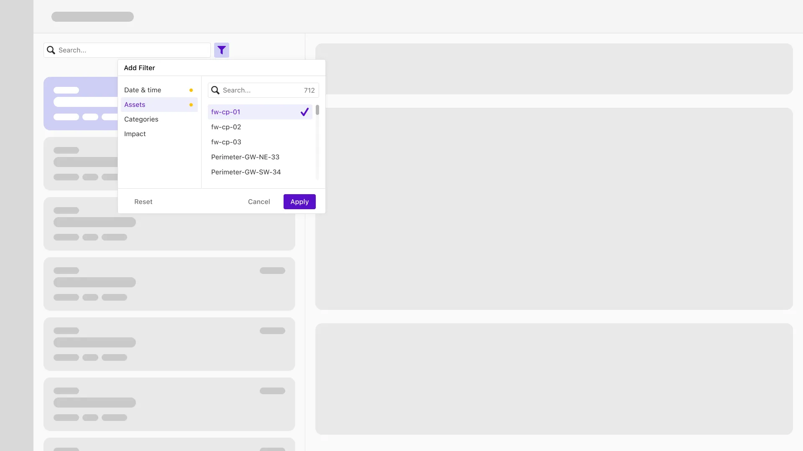
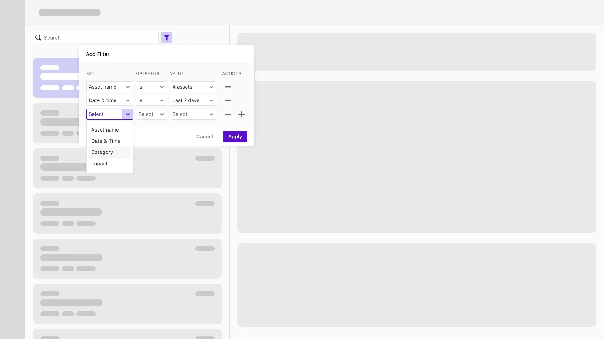
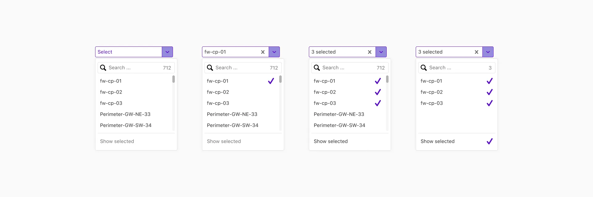

# Sailing the Data Oceans

### Filtering for better user experience

---

In today's digital world, filtering is essential for improving the user experience. With the sheer volume of information available, efficient filtering is necessary for smooth and relevant interactions with digital products.

> Filtering tools allow users to quickly narrow down choices based on their preferences, reducing cognitive load and decision fatigue. This streamlines the user journey, making it more intuitive, efficient, and personalized.

Effective filtering options empower users to control the content they see, thereby boosting engagement and satisfaction. In domains like e-commerce, content libraries, and data-driven applications, filtering is a cornerstone of user-friendly design and meaningful experiences.

### Understanding user needs

---

At [Veriti](https://veriti.ai), a key element of our product's UX design is the 'insight' feature, which provides valuable data about ongoing security issues in the user's environment. Users can review these insights and decide to remediate (address the security issue) or dismiss them.

> In the initial planning phase, we faced challenges in estimating the number of insights an average user would receive.

We soon understood that this number could be large, which might overwhelm users and compromise the product's utility. To address this, we decided to incorporate a filters section.

Our UX approach aimed to simplify the product's learning curve. We believe users should not be burdened with unfamiliar processes when dealing with complex tasks. As a new feature, our goal was to integrate it seamlessly without causing user frustration. Borrowing workflows from comparable products can help minimize the user's learning curve. This allows them to complete their tasks faster and more efficiently.

To determine how best to integrate a filters section, we studied similar industry products and more mature ones. Guided by this research and our previous experience in tackling complex UX tasks, we initiated the design process.

### Iterative design process

---

When we started the design process, we had to work within the constraint that the insights page was already developed. Our task was to adapt to the existing layout without a complete redesign.

The layout of the insights page resembled a typical email application. It featured a large list of items, such as insights, on one side, and detailed information for the selected item on the other. This pattern was common across many pages of our product, so our solution needed to be compatible.

#### First iteration

Our first iteration included a row of three dropdown controls, each corresponding to a filter type. While this approach was straightforward, it lacked scalability for adding more filters in the future. Thus, we continued to explore other solutions.

**Pros**

- Straightforward, simple
- Filter options are visible to the user when scanning the list

**Cons**

- Not scalable
- Not responsive

#### Second iteration

Next, we tried placing filters inside a picker container, which included a list menu on the right side and a window for the options of the selected list item. This setup provided increased scalability for adding more filters in the future.

After a comprehensive review by our team and some design partners, we concluded that the filters needed to have complex grammar, as users tend to interpret data in various ways. Thus, we moved on.

**Pros**

- Scalable

**Cons**

- Not straightforward
- Low visibility of selected filters
- The UX does not meet the new requirements for complex grammar

#### Third iteration

To meet the new requirements, we kept the picker container structure and replaced the inner controls with a loosely designed table structure. Each row in this table is structured from dropdown controls, enabling us to build a more grammar-like filter.

The {Key – Operator – Value} structure suited the need for a more grammatically structured format. The "Key" dropdown contains all possible filter options. The "Operator" allows for complex filtering, such as "is not" options. The "Value" includes all potential matches for the selected filter.

The "Action" column allows the user to add or remove filters as needed. Initially, we limited the number of filters to five to prevent complexity.

**Pros**

- Scalable
- Meets new complex grammar requirements

**Cons**

- Can be overwhelming when five filters are applied
- When more than one value is selected, it's hard to understand the current selection

After reviewing this iteration and receiving mostly positive feedback, we decided to proceed with development.

### Technical implementation

---

During the development of the filters container, we focused on ensuring simplicity and usability. We aimed to enhance user interaction and make it enjoyable:

- A simple animation when adding or removing filter rows to help users understand the process.
- A responsive filters container that adapts to various screen sizes.
- Performance optimization so that results are displayed almost instantly when a user applies filters.

One significant challenge was managing the vast data in the "Value" dropdown control. We needed a solution that would allow users to choose from a long list of options without unnecessary scrolling.

To solve this, we included a search input within the "Value" dropdown. This feature lets users quickly find their desired choice within a large data set.

Another issue was making it easy to edit multiple selections in the "Value" dropdown. For instance, users might select items #3, #30, and #60 from a long list. To expedite their editing process, we added a fixed button at the dropdown's end that displays only their selected items. Although this solution met the requirement, it resulted in a more complex user experience than we initially anticipated.

### Lessons learned

---

Learning is an ongoing process, and each new user experience design provides fresh insights.

> A key takeaway from this project was the value of conducting research on other products. This approach allowed us to move quickly by leveraging others' research, saving us time in delivering this feature to our users.

As a startup with limited resources and various priorities, we've optimized our product feature development process. We've embraced a flexible approach to new feature prototyping, beginning development with initial mockups as early as possible and resolving issues as they occur during development.

While this process might not suit everyone and depends on the team, it has worked well for us, enabling the swift release of the filters feature. Given the product's early stage, further iterations are likely in the near future.

### Conclusion

---

After releasing the filters, we received extremely positive feedback from our users. The filters section helped them understand the required work scope and their environment's overall status more effectively.

The most notable outcome was an increase in the average number of remediations performed by users. This was possible because users could better understand and prioritize security insights by filtering according to their needs.

For our product team, this is a measurable success and a well-executed feature.
