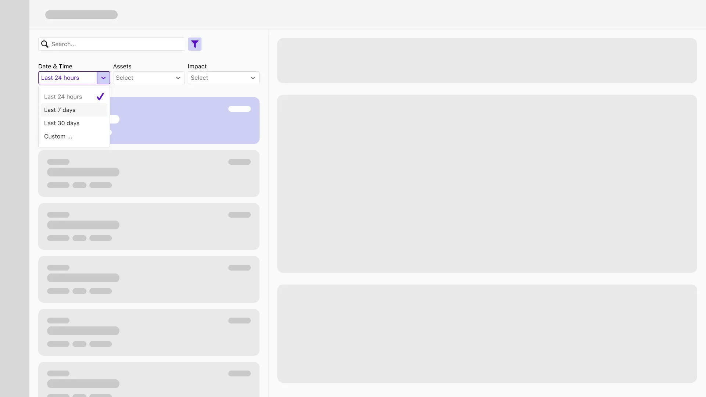
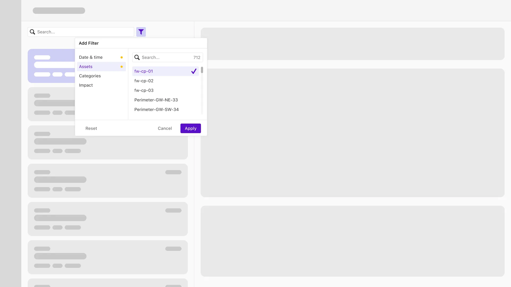
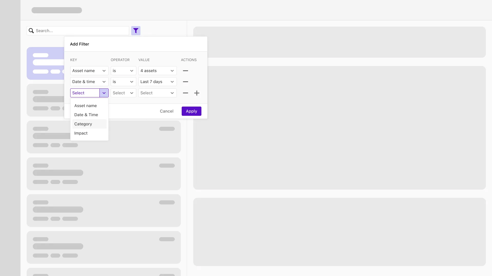
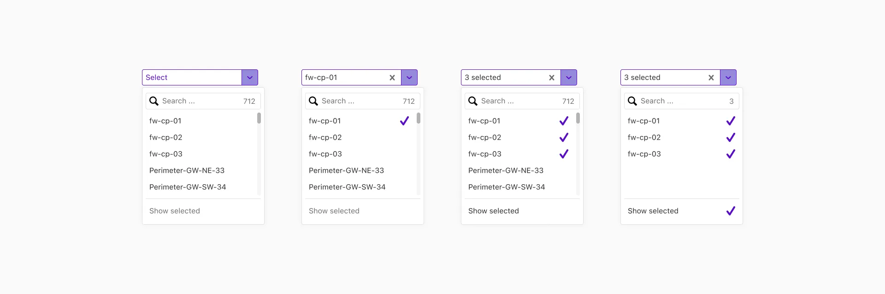

# Sailing the Data Oceans

### A filter grammar for high-volume security insights

---

A Veriti environment could produce more security insights than a team could review one by one. Each insight connected an exposure to a proposed change in the customer's existing security stack. The product made an individual item understandable. The ocean of them was the problem: defining and prioritizing a workable set out of everything the platform could see.

The page already existed as a master-detail view, similar to an email application: a list of insights on one side and the selected insight on the other. The filtering model had to fit this structure without forcing a redesign of a pattern used elsewhere in the product.

The product requirement was broader than adding a few dropdowns. Users needed to express questions with several conditions, understand which conditions were active, and revise part of the query without rebuilding it.

### Establishing the requirements

---

We reviewed filtering patterns in security tools and mature data products. Familiar patterns gave us a starting point, but our data introduced requirements that simple category filters did not cover:

- Support a growing number of filterable properties
- Allow positive and negative operators such as *is* and *is not*
- Support several values inside one condition
- Combine multiple conditions without hiding the current query
- Fit the existing master-detail page and responsive layouts

These requirements quietly turned filtering into a small query language. The design problem was keeping it from feeling like one: users were trying to find their next work set, not write SQL.

### First iteration: visible dropdowns

---

The first direction placed three dropdown controls above the insight list. Each dropdown represented one filter category.

**What worked**

- The available filters were visible while scanning the list
- The interaction was familiar and required little explanation

**What failed**

- Every new category required another control
- The row did not adapt well to smaller widths
- The structure could not express operators or several conditions

The direction was easy to understand but could not support the product as the number and complexity of insights grew.

### Second iteration: a scalable container

---

The second direction moved filters into a dedicated picker. A menu listed the filter categories, while a second area displayed the values for the selected category.

**What worked**

- New categories could be added without extending the page header
- The container could hold more complex controls

**What failed**

- Active filters were difficult to scan
- Editing required moving between the category list and its values
- The model still could not express the conditional grammar users needed

Reviews with the product team and design partners clarified the missing requirement. Users did not only want to select categories. They wanted to express conditions such as *product is not X*, *severity is high or critical*, and *status is unresolved*.

### Third iteration: key, operator, value

---

The third direction kept the scalable container but replaced its inner controls with rows built around three parts:

- **Key:** the property to filter, such as severity, product, or status
- **Operator:** the relationship, such as *is*, *is not*, or *contains*
- **Value:** one or more matching values

This structure matched the way users described the result they wanted. It also gave the product a reusable grammar that could expand as new insight properties became available.

**What worked**

- The same row could represent many types of condition
- Users could combine conditions and see the complete query
- New keys and operators did not require a new page layout

**What remained difficult**

- Several rows could make the query visually dense
- Multiple selected values were hard to summarize inside a compact control

For the first release, we limited the query to five conditions. This kept the initial scope manageable while leaving room to observe how customers built real queries.

### Handling large value sets

---

Some value lists were too large for scrolling alone. Product names, threat indicators, and other properties could produce many potential matches.

We added search inside the value picker so users could narrow the list before selecting an option.

Multiple selections created a second problem. A user might choose values far apart in a long list, then need to review or remove one. We added a fixed control that switched the picker from all available values to the current selection.

The control solved the editing problem, but it also added another state to understand. That trade-off was acceptable for the first release and worth testing with real data.

### Working with an existing product

---

The implementation had to preserve the behavior of the existing insights page. We worked with engineering on three interaction details:

- Animate row additions and removals so the query's structure remained understandable
- Keep the filter container usable across page widths
- Return updated results without breaking the user's editing context

Starting development before every edge case was resolved helped expose issues that static mockups did not. We could test the grammar against real keys, operators, value lengths, and result counts while the interaction was still flexible.

### Outcome

---

The released filter let users isolate a manageable set of insights, see the conditions defining that set, and move from findings into remediation without leaving the existing workflow.

The most important product outcome was not the container itself. It was a filter grammar the platform could extend as its data model grew. The work turned a one-off page control into a reusable way to ask complex questions of security data.
